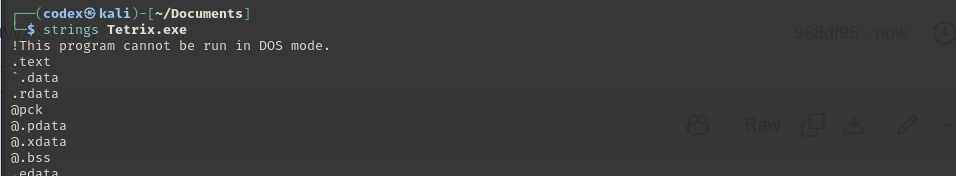
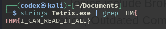

## The Game (TRY HACK ME)
The room [here](https://tryhackme.com/room/hfb1thegame).

## Finding the Flag
After downloading the file,  let's use the `strings`command to see if we can find the **THM** string in that exe file.

There are so many strings, So, we can just search for the  **THM** string if there is one.use the `grep` command.

